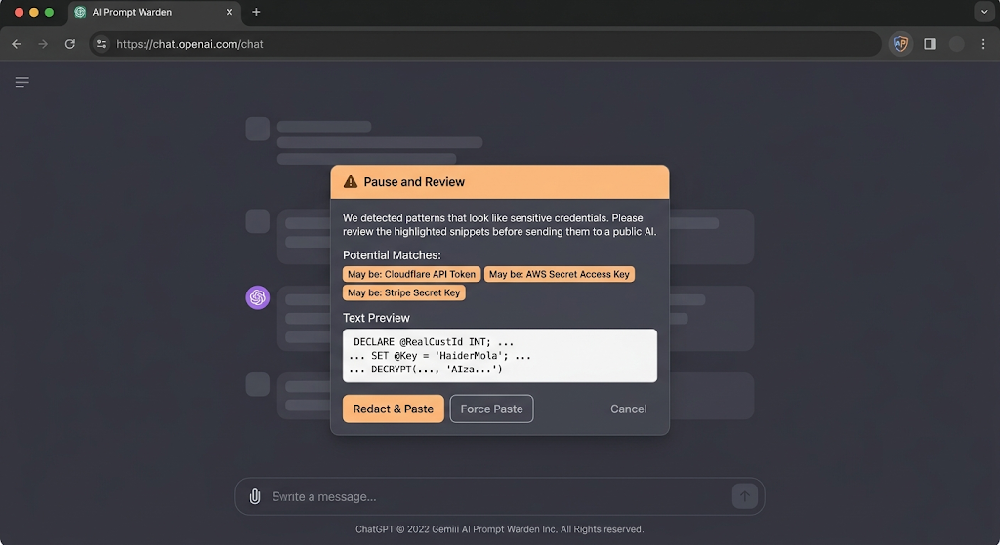

# 🛡️ AI Prompt Warden

**AI Prompt Warden** is a lightweight, high-performance Chrome Extension built with pure frontend technologies. It serves as a local Data Loss Prevention (DLP) net to prevent developers and professionals from accidentally pasting sensitive credentials, API keys, or raw database code into public AI chat systems.

## ✨ Key Features

* **Zero-Footprint Local Scanning:** Scans clipboard data in milliseconds directly in the browser. Zero external API calls—your data never leaves your device.
* **Heavy-Net Pattern Matching:** Uses optimized matching to process a massive, production-grade list of vendor API rules (Stripe, AWS, Cloudflare, etc.).
* **Contextual Safe Redaction:** Feature allowing users to automatically mask active keys and drop an obfuscated version of their text into the AI without breaking application structures.

## 🛠️ Technology Stack

* **Core:** Native JavaScript (Manifest V3)
* **Design:** CSS Event Delegation
* **Engine:** Regular Expressions (Regex) optimized for continuous line-scanning and data loss prevention.

## 🚀 How to Install (Local Developer Mode)

1. Clone or download this repository.
2. Open Google Chrome and navigate to `chrome://extensions/`.
3. Enable **Developer Mode** in the top right corner.
4. Click **Load unpacked** and select the project folder.
5. Head to any AI site (like Gemini or ChatGPT) and try to paste a mock AWS or Cloudflare key to see it in action!

## 📜 License
This project is licensed under the MIT License. Feel free to use, branch, and optimize it.